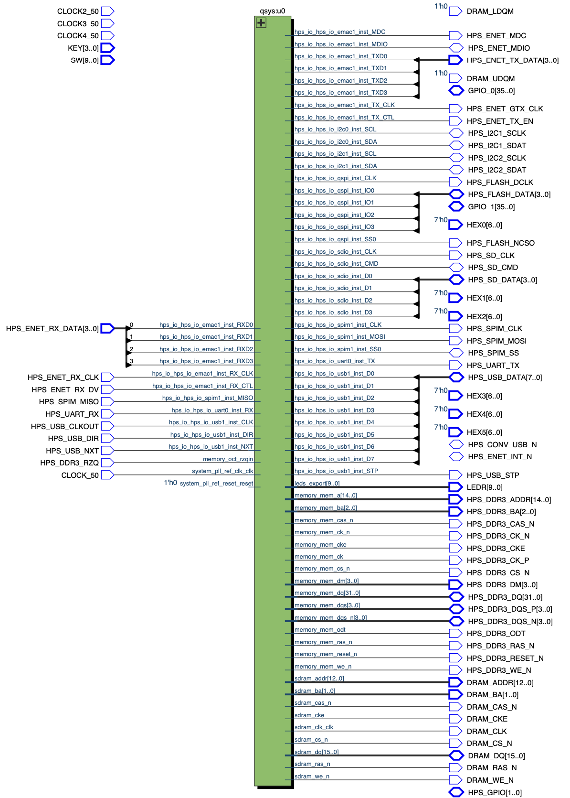
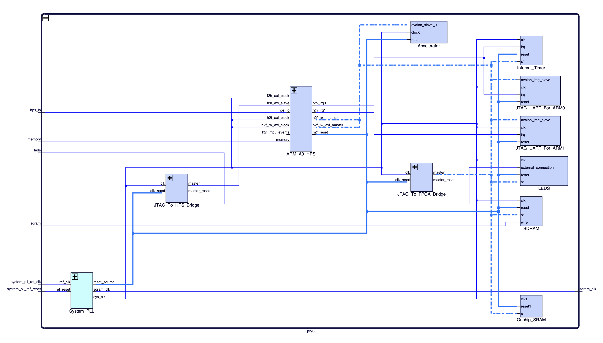
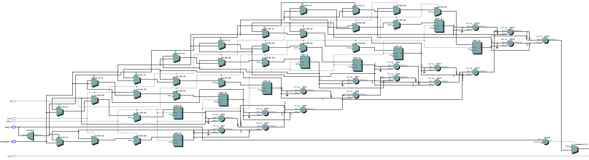
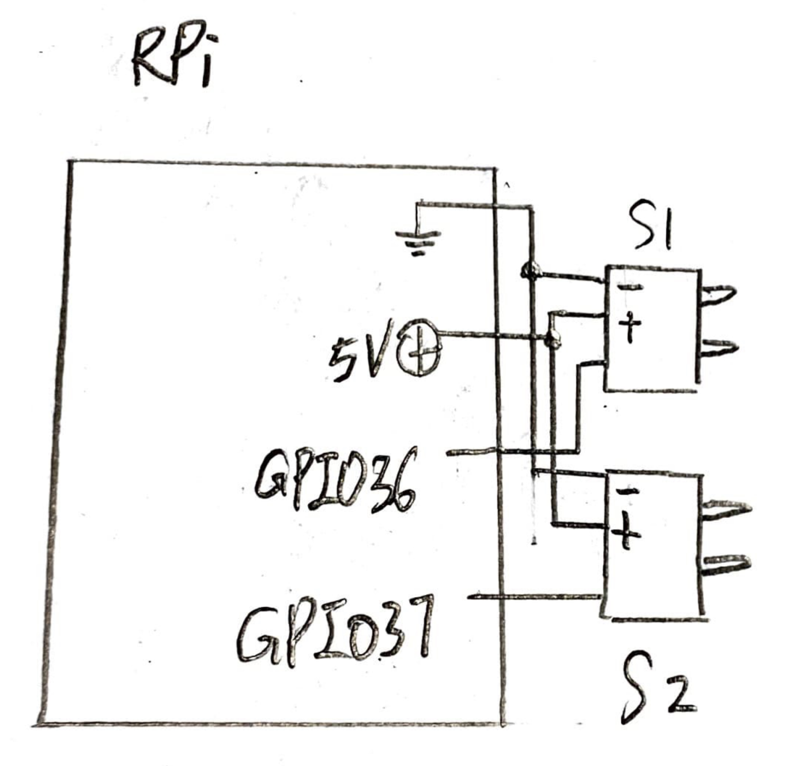

# Foot Traffic Monitor with Thermal Sensing

## What is this?

A system that counts the number of people in and out of a premise, with thermal sensing to identify potential COVID cases to alert staff.

## Description

### Why

With the COVID pandemic, storefronts are implementing capacity restrictions and in some cases, checking the body temperature of customers before letting them in. We would like to automate this process to save businesses the cost of having to station staff at the entrance. This project provides a new tier of precaution and safety to building owners and business operators in keeping their businesses and buildings open as well as keeping people safe. Especially in these unpredictable times of the pandemic, this service is needed now more than ever to reduce operating cost, mitigate the transmission of the virus, and prevent any new waves.

### What

We propose a hardware system that can detect the number of people going in and out of a confined space (for example a grocery store or an office building) and display the flow in real-time in-app, and provide additional analytics for store owners. The thermal component can detect unusually high body temperatures which might signal someone with an active COVID case. In a suspected case, the system will alert staff through an app and also leds on the board. 

### How

A camera and a thermal sensor will be attached to a Raspberry Pi to collect images for OpenCV in order to identify people who pass through the field of view. The DE1-SoC will be used to act as an accelerator for image de-noising and sharpening before the data is fed through OpenCV. A cross-platform mobile application can display statistics accumulated through different timeframes, as well as the live camera feed. The HEX display will be used to show the current number of people within the space and the LED lights will act as a stop sign to stop the flow when a maximum number of people is met. 

## Target Market

Stores, offices, schools etc. any confined place with a lot of foot traffic looking to reduce the cost of flow monitoring and implementing COVID measures.

## Needs and Constraints of Target Market 

1. **Speed**: everything needs to be real-time, the detection and the sensing need to be fast enough to detect and point out the suspected cases before they enter the premises
2. **Easy to use UI**: and easy to understand language and data visualization for a wide target market
3. **Accuracy**: The sensors need to be accurate to detect feverish temperature
4. **Security**: the videos taken will not be stored for long term 
5. **Availability**: the service should be readily available for use (this can be simplified to when the DE1-SOC is on)be able to support multiple exits and entrance

## Project Flowchart

## Hardware Component

The Raspberry Pi will be connected to a video camera, two IR sensors and a thermal sensor. Thermal sensor gate array will be sent to the DE1-SoC via the Ethernet for image processing. 

The DE1-SoC will receive and denoise the thermal gate array data and send them back to the Raspberry Pi via a Ethernet connection. 

The Raspberry Pi will then use OpenCV to detect high temperatures in streams before sending the stream along with statistics to the cloud component. 

### FPGA Top-Level Schematics

### Qsys System Schematics

### Hardware Accelerator Schematics

### IR Sensor Circuit

## Networking Component

Text

## Cloud Component

Text

## User (App) Component

Text